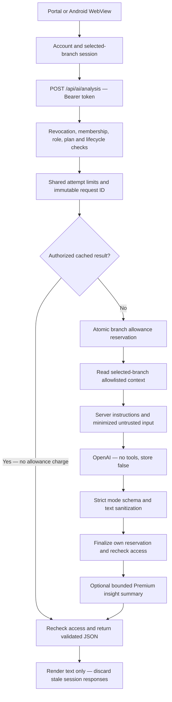

# AI security and release runbook

Implementation runbook, 2026-10-02. Deployment evidence and live provider verification
are recorded separately in the workspace handover.

## Request flow



The browser submits companyId, branchId, mode, requestId, optional question/conversation,
and forceRefresh. Unknown fields, client prompts, model selections and client analytics
are rejected. The old `/api/ai/chat/completions` route returns 410. Authentication
uses only an Authorization Bearer header; query authentication is rejected. The
shared transport restricts tokens to the configured API origin and refuses redirects.
Realtime Database REST authentication is handled separately.

## Context and access

Basic has no AI. Starter permits opschat, realtime, leak and deep with revenue/product
context. Premium additionally permits live, briefing, executive and simulation with
inventory, deterministic operating patterns and sanitized dated insights. Existing
owner/manager restrictions and branch-wide allowances remain; staff cannot use AI.
Authorization checks entitlement expiry, cancellation, closure, maintenance, tombstones
and membership before caches, before provider transmission and before returning content.

Only the selected branch is read. Allowlisted totals, active product performance,
period history and deterministic patterns are retained. Raw orders, customer identities,
contact fields, Firebase UIDs, payment details, PINs and provider secrets are not forwarded.
Product labels remain useful business context. Labels, questions and memory receive
bounded contact redaction and credential detection. This is deterministic minimization,
not a guarantee that arbitrary prose contains no personal information. Do not paste
customer information or credentials into questions. Matched credentials are rejected.

All supplied business data and conversation live in the user message. Server instructions
are separate. There are no AI tools, URL fetches, database writes or generated links.
Output must match its mode schema; unknown fields, invalid sizes, credential-like text
and invalid values fail closed. The existing UI renders ordinary React text.
The provider receives that same Pydantic contract as strict `json_schema`, including
nullable simulation fields, text bounds and required keys; generic JSON mode is not
enough to enforce it. See [OpenAI Structured Outputs](https://developers.openai.com/api/docs/guides/structured-outputs).
Truncated, filtered, refused, empty or malformed completions fail without a corrective
provider replay. Their reported token usage remains counted; receiving an invalid
answer does not open the transport circuit breaker.

## Limits, cache and retries

- Request: 64 KiB, including chunked bodies; question: 2,000 characters; conversation:
  10 turns of 400 characters. Provider input is bounded at 32,000 characters.
- Model: server-owned gpt-6-luna with explicit reasoning_effort=none. Mode output limits range from 350 to 2,600 tokens.
  Legacy temperature is omitted; existing token caps and timeout remain unchanged.
  Optional context rows are deterministically pruned and truncation is disclosed;
  recorded totals are preserved.
- Authenticated attempts, including cache hits: 6 per UID and 20 per branch per minute.
  Generation slots: 1 per UID, 2 per branch; leases last 180 seconds.
- Shared transaction metadata is at client-denied aiControls and aiRequests. aiUsage
  remains the branch allowance ledger. Branch deletion removes scoped metadata.
- Cached reports are process memory only, actor/branch/tier/period/mode scoped,
  bounded to 100 entries. Completed request recovery is separately bounded to 100 entries.
  Cache reads enforce TTL; idle expired entries disappear on access or bounded eviction.
  Handoff is dated in Philippine time. Cache hits cost no branch allowance but persist
  an immutable request claim, so the same ID cannot later start a generation.
- Normal report TTL / refresh cooldown: realtime 30/3 minutes, live 55/5,
  deep 60/10, executive 60/15, leak 30/10. Handoff is once per calendar day.
  Chat and simulations do not use semantic report caching.
- Provider timeout: 30 seconds; SDK retries: zero. One additional attempt is allowed
  only when the exception chain proves connection establishment failed before transmission.
  Read timeouts/disconnects and unknown failures are not automatically retried or refunded.
- Confirmed failures refund only their own reserved claim, once. Uncertain requests keep
  their allowance charge and immutable ID. After restart or completed-cache eviction,
  repeated IDs return 409 instead of regenerating. Operators can inspect protected
  metadata; do not delete claims to make uncertain requests replayable.
- Browser requests serialize and deduplicate. Ambiguous retries reuse the same UUID.
  Confirmed 400/401/403/422/429 refusals permit a later deliberate attempt with a new ID.

Chat/feed data is memory only. Logout, account/branch/tier/period changes, read errors,
access loss and reload clear it. Previous listeners and requests are aborted and late
callbacks discarded. Legacy AI storage keys are purged without clearing unrelated
preferences. Names and greetings are personalized locally.

## Premium insight retention

Memory contains summaries, never raw chats: at most 300 characters per entry,
100 entries per branch, up to 90 days. Invalid/future dates and credential-like summaries
are omitted. Reads/writes enforce these bounds; the independent startup/daily worker
also previews expiry without requiring lifecycle deletion to run.

The worker defaults to dry run. Review a targeted preview using backend operator
credentials kept in environment secrets:

```sh
python scripts/maintain_ai_insights.py --company company-example --branch branch-example
```

Use `--apply` only after reviewing the selected branch preview. To enable the independent
worker's physical summary purge, set `TOUCHORDERS_AI_RETENTION_APPLY=true` in the backend
and restart it. This flag affects insight retention only; it does not enable business
lifecycle deletion. Keep it off until review. Its shared concurrency lease prevents
simultaneous daily sweeps. Aggregate branch/removal counts are logged, without summaries.

## Configuration and observations

Keep FIREBASE_SERVICE_ACCOUNT_JSON, FIREBASE_DATABASE_URL and OPENAI_API_KEY only in
backend secrets. Rotate credentials previously disclosed in messages or screenshots and
verify old keys are revoked; this task does not perform operator-side rotation.
Production/staging enforce `https://api.openai.com/v1`; alternate provider/proxy origins
are rejected on startup. Surrounding key/URL whitespace normalization remains fixed.

`/health/ready` distinguishes configuration from the last observed AI success/failure.
It makes no paid provider probe. Recent success expires after 15 minutes. Readiness does
not replace a signed-in smoke test. Failure diagnostics use categories, hashed branch
scope, request UUID, timings and token counts; no prompt, response, raw exception chain
or provider body is logged. A final filter also scrubs third-party and access logs.
Validation failures additionally report bounded reason codes and schema-owned field
paths, such as `answer` / `string_too_long`. Unknown output keys, input values,
Pydantic messages/context and refusal text are omitted. Match the request UUID when
diagnosing a 503; category `validation` alone does not identify the rejected field.

`store=false` does not itself guarantee provider-level Zero Data Retention. Review the
operator's applicable provider data controls before making retention promises.
[OpenAI data controls](https://developers.openai.com/api/docs/guides/your-data).

## Coordinated release

1. Review the portal/backend/rules diff. Preserve unrelated docs and local Android edits.
   Confirm the three rule paths match and the Android test mirror uses its relative link.
2. Run web/backend/rules suites, production web build and isolated UI checks. Native
   builds remain debug only. Do not run PIN fixtures or clear device data.
3. Publish the backend, portal and rules as one coordinated release. Existing browser
   sessions using the retired route need a hard reload. Do not restore the unsafe adapter
   as a rollback. Hosting's public-policy gate remains separate and intentionally blocked
   for a normal release until operator approval; an existing authorized draft live-test
   release must retain its visible draft notices.
4. Check deployed asset hash, new route authentication and old route 410. Use isolated
   Starter/Premium branches to test every mode, quota/cache behavior, revocation and expiry.
   Inspect category-only logs and provider usage. Local fake responses do not prove live
   model schema compliance, quality, budget or all-mode operation.
5. Review targeted insight maintenance before enabling its apply flag. Complete credential
   rotation/provider control review. QR Ph, lifecycle configuration and public policy
   approval remain separate release blockers.

Local evidence is in the workspace's verification/ai-security-2026-10-02 directory.
